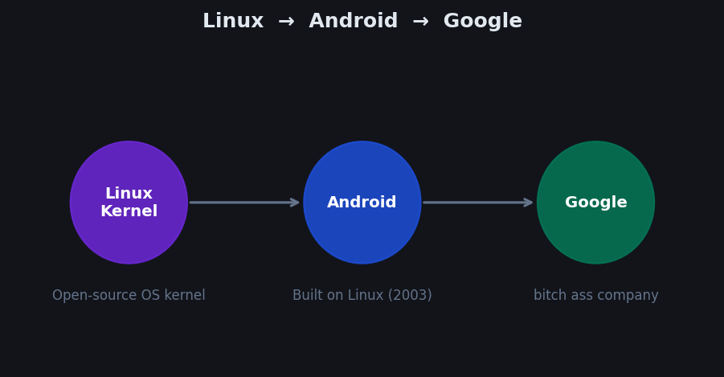
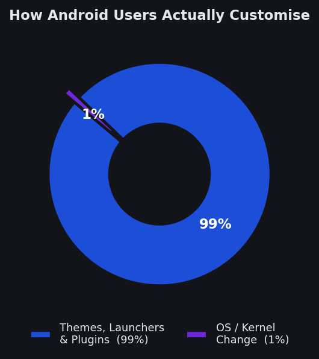
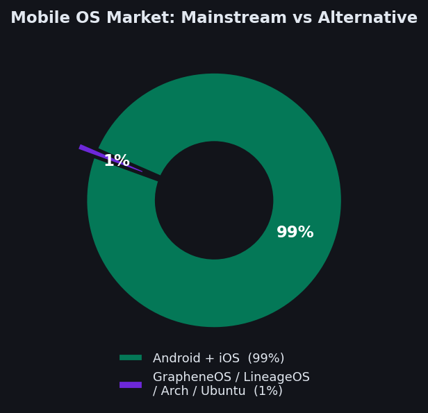

+++
title = "Running Linux on My Samsung Tab: A Tinkerer's Guide"
date = 2026-05-14T04:00:00+05:30
draft = false
slug = "linux-on-android-tablet"
description = "How I installed Ubuntu with XFCE on my Samsung Tab A8 using Termux — covering Android's Linux roots, customization stats, and every command you actually need."
tags = ["android", "linux", "termux", "ubuntu", "xfce", "samsung"]
categories = ["Programming"]
+++

# Running Linux on My Samsung Tab

I have a **Samsung Tab A8** and I mainly use **Linux on all my desktops**. Naturally, I wanted to tinker with the tablet — try installing Linux on it, poke around with Ubuntu or Arch, and see how far I could push it.

This post covers the whole thing: how Android and Linux are actually connected, how most people customize Android (and how few go deep), and the actual step-by-step install.

> **Note:** This is not a full kernel replacement. Android still runs underneath — this is a Linux userspace container sitting on top of Android.

---

## Part 1 — How Android and Linux Are Actually Connected

Before touching anything, it helps to understand the underlying architecture.

- **Linux** is the kernel — the core of the operating system.
- **Android** started as a project **built on top of Linux**.
- **Google** acquired Android in 2005 and integrated it into their ecosystem.

Everything is connected. Android *is* Linux at the kernel level — it just has Google's stack, the Dalvik/ART runtime, and the Android framework layered on top. When you run Linux on Android, you are running a second Linux userspace alongside Android's own.



---

## Part 2 — Android Customization: Where Most People Stop

Most people customise their Android. Very few go deep. The four major areas:

| Category | Examples |
|---|---|
| **Custom OS / ROMs** | LineageOS, GrapheneOS, Arch Linux, Ubuntu |
| **Launchers** | Pixel Launcher, Nova Launcher, Neo Launcher |
| **Widgets** | Nothing Widgets, OnePlus Widgets, Samsung Widgets |
| **Themes & Wallpapers** | Colour schemes, icon packs, wallpaper engines |

Android is a lot like **Windows** in terms of customisation culture — most people change the skin, but nothing at the kernel level. Here is what the actual breakdown looks like:



And zoomed out to overall mobile OS market share. Then the next pie graph is Android and iOS is 99% and 1% is Graphene OS, Lineage OS, ARCH and Ubuntu, which I've been running on:



I have been running in that 1%.

---

## Part 3 — Installing Ubuntu + XFCE on the Tab

Now the real part. **Ubuntu 22.04 + XFCE**, viewed over **VNC**.

### Step 1 — Choose Your OS

Options include Arch, Ubuntu, Manjaro, and Debian. For this guide: **Ubuntu 22.04 + XFCE**. It is stable and light enough to actually use on a tablet.

### Step 2 — Install Termux and a VNC Client

Install **Termux** from **F-Droid** or the GitHub releases page — not the Play Store version, it is outdated. Give it storage access, background permission, and anything else it asks for.

Then install a VNC client. I use **bVNC Pro** — it has been the most reliable for me. **Termux:11** also works and is free.

VNC lets you see the Linux desktop over the network. Linux runs a VNC server on a port, you point your VNC app at it, and you see the GUI.

### Step 3 — Run the Install Command in Termux

Paste this entire command into Termux:

```bash
pkg update -y && pkg install wget curl proot tar -y && wget https://raw.githubusercontent.com/AndronixApp/AndronixOrigin/master/Installer/Ubuntu22/ubuntu22-xfce.sh -O ubuntu22-xfce.sh && chmod +x ubuntu22-xfce.sh && bash ubuntu22-xfce.sh
```

What this does:
1. Updates Termux packages
2. Installs `wget`, `curl`, `proot`, `tar`
3. Downloads the Ubuntu 22.04 + XFCE setup script
4. Makes it executable and runs it

After the script finishes, Linux will **not** start automatically. You will land at a prompt like:

```
root@localhost:~/#
```

You are now inside the Ubuntu container.

### Step 4 — Start the VNC Server

Add your device's IP in your VNC app first. Then, inside the Ubuntu container, run:

```bash
vncserver :1
export DISPLAY=:1
startxfce4 &
```

- `vncserver :1` — starts the VNC server on port 5901
- `export DISPLAY=:1` — sets the active display
- `startxfce4 &` — launches the XFCE desktop in the background

Connect your VNC app to `127.0.0.1:5901` and you should see the XFCE desktop.

> **Ubuntu is now running on your Android tablet.**

### Step 5 — Post-Setup Inside Linux

Open the terminal *inside the XFCE session* — not Termux, the actual Linux terminal in the VNC window — and run:

```bash
apt update && apt upgrade -y
```

Then install what you need: internet drivers, audio drivers, file managers, and so on. This part varies by device. It is complicated, but worth the effort.

---

## Daily Commands

**To start:**

```bash
./start-ubuntu22.sh
```

Then inside the container:

```bash
vncserver :1
export DISPLAY=:1
startxfce4 &
```

**To stop — do not skip this:**

```bash
vncserver -kill :1
exit
```

Then swipe away or end the Termux session from the notification. Kill VNC first, exit the container, then close Termux. Skipping steps can leave orphaned processes running in the background.

---

## Wrapping Up

If you understood something nice and interesting and learned something from the blog, check out my **[GitHub](https://github.com/)** for more interesting stuff and normal Padre utility experience to scientists amen o fortuna.
